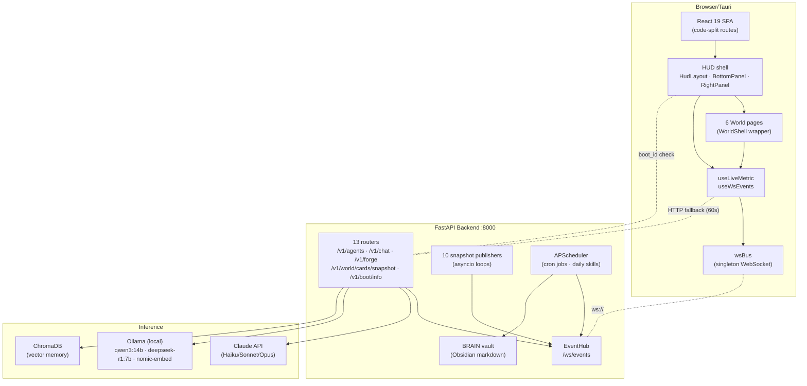

# Nexus9 — Architecture (David's fork)

> Quick-reference for what David's Nexus9 fork adds on top of upstream
> OpenJarvis. The upstream architecture (engine/agents/memory/learning)
> still lives under [`docs/architecture/`](../architecture/overview.md);
> this page is about the **Command Center HUD + live data fabric**
> built on top.

## Stack at a glance



## Live data fabric (the most important pattern)

Every HUD card used to poll its own HTTP endpoint every 2–8 seconds.
For a single tab open this generated ~140 idle requests per minute,
and N tabs meant N× that. Two things now multiplex it down to ~0:

1. **Backend `snapshot_publisher`** — `start_publishers(app)` is called
   from `_lifespan` and spawns one asyncio loop per topic. Each loop
   fetches data (same functions the HTTP endpoints call) and publishes
   it to the `EventHub` with a `source: "snapshot/<topic>"` tag and the
   payload nested under `data`. Topics + cadences:

   | Topic | Cadence | Source |
   |---|---|---|
   | `snapshot/system-metrics` | 2 s | `health_router.system_metrics()` |
   | `snapshot/jobs` | 6 s | `crew_router.list_crew_jobs()` |
   | `snapshot/world-cards` | 6 s | `world_cards_router.world_cards_snapshot()` |
   | `snapshot/agents` | 8 s | `agents_router.agents_list()` |
   | `snapshot/budget` | 8 s | `agents_router.get_budget()` |
   | `snapshot/docker` | 8 s | `monitoring_router.docker_containers()` |
   | `snapshot/health` | 10 s | `health_router.health_deep()` |
   | `snapshot/chromadb` | 12 s | `monitoring_router.chromadb_stats()` |
   | `snapshot/models` | 30 s | `chat_router.models_list()` |
   | `snapshot/scheduled` | 60 s | inline from `app.state.scheduler` |

2. **Frontend `wsBus`** — single `WebSocket` opened once per page load
   and shared by every subscriber. `useLiveMetric({ wsTopic })`
   subscribes to events matching that source; matching events replace
   `data` without an HTTP call. The original HTTP poll stays as a
   60-second safety net.

```text
  card.useLiveMetric(fetchX, { intervalMs, wsTopic })
    ├── HTTP   /v1/x       (initial paint + 60s fallback)
    └── WS     wsBus.subscribe(source === wsTopic)  ← real-time path
```

A "TELEGRAM ACTIVITY" or "MODEL ROUTING" card never makes an HTTP call
in steady state; the backend pushes 50 frames/min over the single WS
no matter how many cards or tabs are listening.

## Boot intro flow

```text
   user opens / refreshes the SPA
                │
                ▼
   App.tsx mounts <NexusBootIntro />
                │
                ▼
   GET /v1/boot/info  ──►  { boot_id, started_at }
                │
                ▼
   compare with localStorage('nexus9.intro.boot-id')
   ┌──────── match ────────┐    ┌──── different ────┐
   ▼                       ▼    ▼
 skip overlay         play overlay (video → onEnded → finish
 (already played      placeholder HUD with terminal trace +
  this boot)          progress bar if /intro/boot.mp4 404s)
                            │
                            ▼
                  persist new boot_id, unmount overlay
```

`BOOT_ID = uuid.uuid4().hex` is generated at Python process start, so
every uvicorn restart replays the splash exactly once per browser.

## Frontend layout

```text
  src/
    App.tsx                       ─ routing + lazy() chunks per page
    components/
      Layout/{HudLayout,BottomPanel,RightPanel}.tsx
      WorldShell/WorldShell.tsx   ─ generic 3-col dashboard (shared
                                    by 5 world pages, parameterised
                                    on colorKey + cardRegistry +
                                    imageCandidates + defaultSeeds)
      CommandCenter/*.tsx         ─ ~15 live cards (BudgetCard,
                                    AgentActivityCard, DockerLiveCard,
                                    QuickForgeCard, …)
      JarvisWorld/*.tsx           ─ ACTIVATE / AUTO skills + modal
                                    activator (different shell shape,
                                    not WorldShell)
      Boot/NexusBootIntro.tsx
      AgentNetwork/AgentDetailPanel.tsx
    pages/
      WorldForgePage.tsx          ─ thin wrapper around WorldShell
      WorldVaultPage.tsx          ─ idem + LAYOUT_VERSION migration
      WorldDockerPage.tsx         ─ idem + defaultSeeds: containers
      WorldCommercePage.tsx       ─ idem
      WorldCyberdeckPage.tsx      ─ idem
      WorldJarvisPage.tsx         ─ special (skills, not cards)
      ...
    hooks/useLiveMetric.ts        ─ HTTP poll + wsTopic merge
    lib/wsBus.ts                  ─ singleton WS multiplexer
    lib/ws.ts                     ─ low-level connectWs() w/ backoff
```

Adding a new world page is **~45 lines**: a wrapper that declares
`CARD_REGISTRY`, image candidates, optional `defaultSeeds`, and hands
them to `<WorldShell>`. Adding a new card type is one entry in any
registry — same component shape as any other Lucide-icon `CardDef`.

## Backend layout

```text
  backend/
    main.py                       ─ FastAPI factory + _lifespan:
                                    start_publishers, scheduler,
                                    Ollama heartbeat, BOOT_ID
    snapshot_publisher.py         ─ 10 asyncio loops (this session)
    ws_router.py                  ─ /ws/events + /v1/events/{recent,publish}
    {agents,chat,crew,health,monitoring,world_cards,daily,...}_router.py
    daily_tasks.py                ─ APScheduler cron jobs +
                                    _write_skill_brain_note that
                                    publishes a clickable event
    brain_autolinker.py           ─ Obsidian backlinks crawler
    BRAIN/BRAIN/                  ─ vault root (not vault_notes/)
    .env                          ─ gitignored — never committed
```

## Asset pipeline

| Folder | What | Optimisation |
|---|---|---|
| `frontend/public/agents/` | 7 agent portraits | 512px max + WebP @ q82, PNG fallback. 30 MB → 367 KB (-99 %). |
| `frontend/public/world/` | 6 hero images | 2560px max + WebP @ q85, PNG fallback. 63 MB → 3.1 MB (-95 %). |
| `frontend/public/intro/` | `boot.mp4` (2.5 MB) | mp4 H.264, ~10s, dark background. Replays once per backend boot. |

WebP is preferred via `<picture><source type="image/webp">` with PNG
inside `` for older browsers. Files > 2 MiB are excluded from the
SW precache (see `vite.config.ts` `workbox.globIgnores`).

## Local quickstart

```pwsh
# All three at once (Windows native)
START_ALL.bat

# Or piece by piece:
# 1) Ollama (must be running first — backend health-checks it)
ollama serve

# 2) Backend (FastAPI on :8000, serves the SPA too if built)
cd backend
.\.venv\Scripts\python.exe -m uvicorn main:app --host 0.0.0.0 --port 8000

# 3) Frontend dev server (hot reload, :5173)
cd frontend
npm run dev

# Tests
cd backend && .\.venv\Scripts\python.exe -m pytest        # 21 tests
cd frontend && npm test                                    # 24 tests

# Build prod bundle (Vite + service worker)
cd frontend && npm run build
```

The CORS allow-list (`backend/main.py`) covers localhost:5173, :8000,
:1420 (Tauri default). Set `NEXUS9_CORS_ORIGINS=https://your-domain`
(comma-separated) to extend it without touching code.

## Key endpoints

| Endpoint | Purpose | Notes |
|---|---|---|
| `GET /v1/info` | Server identity (name, version, host, model) | First paint check |
| `GET /v1/boot/info` | `{ boot_id, started_at }` | Per-uvicorn-process uuid; drives `NexusBootIntro` |
| `GET /v1/agents` | Agent roster + status + provider/model | Pushed via WS `snapshot/agents` |
| `GET /v1/budget` | Per-session Claude spend, budget guard | WS `snapshot/budget` |
| `GET /v1/models` | Claude + Ollama models (filtered) | WS `snapshot/models` |
| `GET /v1/chat/completions` | Main chat endpoint (Claude + Ollama routing, skill catalog injection) | POST |
| `GET /v1/forge/mission` | Trigger STL forge mission | POST · used by QuickForgeCard |
| `GET /v1/world/cards/snapshot` | 13 world-card metrics in one payload | WS `snapshot/world-cards` |
| `GET /v1/system/metrics` | CPU/RAM/VRAM/net | WS `snapshot/system-metrics` |
| `GET /v1/health/deep` | Per-service health | WS `snapshot/health` |
| `GET /v1/docker/containers` | nexus_* container roster | WS `snapshot/docker` |
| `GET /v1/chromadb/stats` | Vector store stats | WS `snapshot/chromadb` |
| `GET /v1/crew/jobs` | CrewAI job queue | WS `snapshot/jobs` |
| `GET /v1/daily/status` | APScheduler job list | WS `snapshot/scheduled` |
| `GET /v1/events/recent?limit=N` | EventHub replay history | Useful for debugging WS |
| `POST /v1/events/publish` | Inject a custom event into the hub | Used by `SkillActivator` on success |
| `WS /ws/events` | Live event stream + hello-frame history replay | The bus |

## Skill system

13 skills under `backend/skills/`:

- **TOML auto-exec** (4): `docker-health`, `docker-logs-check`,
  `docker-stats`, `docker-restart-container` — invoked by the tool-use
  layer when JARVIS decides to call them.
- **Hermes protocols** (9): `systematic-debugging`, `humanizer`,
  `ideation`, `plan`, `codebase-inspection`, `obsidian`, `blogwatcher`,
  `polymarket`, `comfyui` — markdown protocols read by `skill_get` and
  followed verbatim.

3 daily + 3 weekly are scheduled via APScheduler with cron triggers in
`daily_tasks.create_scheduler()`. Each scheduled run writes a brain
note at `02_Daily/<today>/skill-<name>.md` AND publishes a clickable
completion event to the RightPanel alerts feed (note path embedded so
the row opens the note via `obsidian://open?vault=BRAIN&file=…`).
